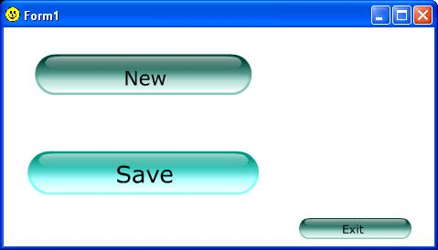



## Flash button in VB forms

### Description

This sample app demonstrate how to use the designed button constructed under Flash and incorporated it with vb6

in a way that such button shall behave the way a vb6 normal button does (Click Event in this example).

Please vote..thanks.

In this way we shall be able to add more better look for the interface which we would think would only be applicable

on the web browsers. by default, shockwave control add-in in vb application does not support click event.
 
### More Info
 
Flash-made buttons

Note:

on the construction of the Flash button be sure to add the script below:

on (release)

{

fscommand("ButtonClick", "value");

}

'

----

that script shall allow he click event later if used on the vb6 interface.

             |
---                |---
**Submitted On**   |2005-02-21 20:20:08
**By**             |[WCM](https://github.com/Planet-Source-Code/PSCIndex/blob/master/ByAuthor/wcm.md)
**Level**          |Beginner
**User Rating**    |4.5 (18 globes from 4 users)
**Compatibility**  |VB 6\.0
**Category**       |[Custom Controls/ Forms/  Menus](https://github.com/Planet-Source-Code/PSCIndex/blob/master/ByCategory/custom-controls-forms-menus__1-4.md)
**World**          |[Visual Basic](https://github.com/Planet-Source-Code/PSCIndex/blob/master/ByWorld/visual-basic.md)
**Archive File**   |[Flash\_butt1856132212005\.zip](https://github.com/Planet-Source-Code/wcm-flash-button-in-vb-forms__1-59002/archive/master.zip)

